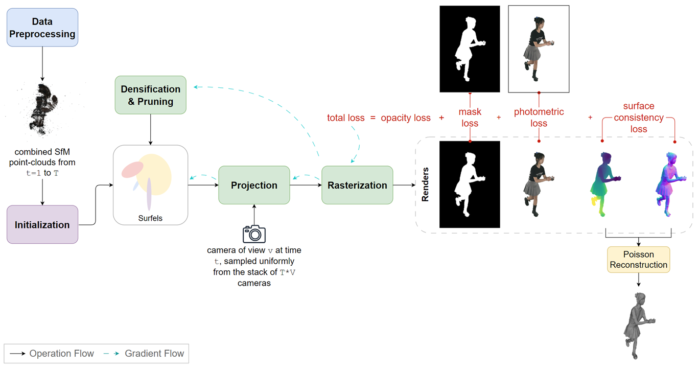

<h1 style="text-align: center;">Spacetime Surfels: Dynamic Surface Reconstruction from Multi-View Data using Gaussian Surfels</h1>

<div align="center">
  
</div>

## Overview
This repository contains the implementation of Spacetime Surfels, a method developed for my master's thesis on dynamic surface reconstruction using Gaussian Splatting. The work addresses the critical gap between dynamic view synthesis and surface reconstruction within the 3D Gaussian Splatting framework, introducing a novel framework that enables efficient reconstruction of temporally consistent surface meshes from multi-view video sequences. The full thesis can be found in `./assets/thesis.pdf`. The code builds upon the [Gaussian Surfels](https://github.com/turandai/gaussian_surfels) code base and borrows some code related to the dynamic part from [SpacetimeGaussians](https://github.com/oppo-us-research/SpacetimeGaussians).

<div align="center">
  
</div>

<div align="center">
*Overview of our Spacetime Surfels approach for dynamic surface reconstruction.*
</div>

## Environment Setup
We did our experiments on Ubuntu 22.04.4, CUDA 11.8, and conda environment on Python 3.10.

Clone this repository:
```shell
git clone https://github.com/fraunhoferhhi/spacetime-surfels.git
cd spacetime-surfels
```

Create conda environment:
```shell
conda create -n spacetime-surfels python=3.10
conda activate spacetime-surfels
```
Install pytorch, torchaudio and torchvision following [PyTorch's official installation guide](https://pytorch.org/get-started/locally/).

Install other packages and CUDA rasterizer:
```shell
pip install -r requirements.txt
pip install submodules/diff-gaussian-rasterization submodules/simple-knn
```

## Data Preparation
The data format expected is the same as for SpacetimeGaussians. It should be like:
```shell
data_root/
    ├── colmap_0/ # timestamp 0
        ├── images/
        │   ├── 00.png # cam view 0
        │   ├── 01.png # cam view 1
        │   ├── 02.png # cam view 2
        │   ├── ...
        ├── masks/
        │   ├── 00.png # cam view 0
        │   ├── 01.png # cam view 1
        │   ├── 02.png # cam view 2
        │   ├── ...
        ├── normal/
        │   ├── 00_normal.npy # cam view 0
        │   ├── 01_normal.npy # cam view 1
        │   ├── 02_normal.npy # cam view 2
        │   ├── ...
        ├── cameras.txt
        ├── images.txt
        ├── points3D.txt
    ├── colmap_1/ # timestamp 1
    ├── colmap_2/ # timestamp 2
    ├── ...
    ├── colmap_N/ # timestamp N
```
## Datasets

This project uses two publicly available multi-view video datasets for evaluation:

**DNA (Diverse Neural Actor) Rendering Dataset** - High-quality multi-view captures of human performances with 150 frames from 60 synchronized cameras at 2048×2448 resolution. We use 5 sequences featuring diverse daily actions and traditional performances. [[Paper]](https://arxiv.org/abs/2307.10173) [[Dataset]](https://dna-rendering.github.io/)

**NHR (Neural Human Rendering) Dataset** - Multi-view sequences captured in a dome structure providing 360° views. We use 4 sequences including controlled exercise routines and basketball scenes with 57-73 cameras at mixed resolutions. [[Paper]](https://openaccess.thecvf.com/content_CVPR_2020/html/Wu_Multi-View_Neural_Human_Rendering_CVPR_2020_paper.html) [[Dataset]](https://github.com/wuminye/NHR)

Both datasets include camera poses, intrinsics, and foreground segmentation masks required for dynamic surface reconstruction.

## Training
For training the model, run the following command. Make sure the source path points to the first frame of the data (i.e. the colmap_0 folder). 
```shell
python train.py -s {path/to/data_root/colmap_0} -m {path/to/output} --config {path/to/config/file}
```
This will train the first 50 frames (or any the number of frames specified in the config file). To train the next 50 frames, set path to colmap_50 as source:
```shell
python train.py -s {path/to/data_root/colmap_50} -m {path/to/output} --config {path/to/config/file}
```
Example config files dor DNA and NHR datasets can be found in `configs/`.

After training all subsequences, the output structure looks like this:
```shell
output_root/
    ├── 0to49/ 
        ├── point_cloud/
        │   ├── iteration_15000/
        |   |   ├── point_cloud.ply
        │   ├── iteration_30000/
        |   |   ├── point_cloud.ply
        ├── progress/
        │   ├── it0.png
        │   ├── it1000.png
        │   ├── it2000.png
        │   ├── ...
        ├── cameras.json
        ├── cfg_args.json
        ├── eval_result.txt
    ├── 50to99/
    ├── 100to149/
```

## Rendering
To render the test and train images as well as extracting the mesh at each time step, run the following command. Parent path represents the path to output root. 
```shell
python render.py --parent_path {path/to/output_root}
```
This will render all subsequences included in the parent path (i.e. 0-49, 50-99, 100-149, ...).

After rendering, the output folder structure looks like this:
```shell
output_root/
    ├── 0to49/ 
    ├── 50to99/
    ├── 100to149/
    ├── meshes_o3d/
    |   ├── poisson_it30000_depth9/
    |   |   ├── f000000_cleaned.ply
    |   |   ├── f000000_plain.ply
    |   |   ├── f000001_cleaned.ply
    |   |   ├── f000001_plain.ply
    |   |   ├── ...
    ├── render/
    |   ├── test/  # contains ground truth and renders from test views at all timesteps
    |   ├── train/ # contains ground truth and renders from train views at all timesteps
```

## Evaluation
```shell
python evaluation/evaluate.py --in_dir {path/to/output_root}/render --output_file {path/to/eval/results}/eval.json
```

## Video Rendering
To render a video of the mesh, rgb, depth and normals, you can run the following command:
```shell
python render_video.py --parent_path {path/to/output_root}
```

There's options to make the object rotate (`--rotate`), scale the focal length (`--scale_f_len 0.5`), offset the start of the rotation (`--rotation_offset 10`), pause on a specific time frame (betwenn 0 and total number of frames) (`--stop_at 30`) and specifiy the frames per second (`--fps 24`).

<section class="section" id="BibTeX">
  <div class="container is-max-desktop content">
    <h2 class="title">BibTeX</h2>
    <h3>Please cite this thesis if you find it useful for your research or projects:</h3>
    <pre><code>@mastersthesis{BrianneOberson_2025_SpacetimeSurfels,
            title={Spacetime Surfels: Dynamic Surface Reconstruction from Multi-View Data using Gaussian Surfels},
            author={Brianne Oberson},
            school={Technische Universität Berlin},
            year={2025},
            type={Master's thesis}
        }</code></pre>
    </code></pre>
    <h3>Related work:</h3>
    <pre><code>
        @inproceedings{Dai2024GaussianSurfels,
            author = {Dai, Pinxuan and Xu, Jiamin and Xie, Wenxiang and Liu, Xinguo and Wang, Huamin and Xu, Weiwei},
            title = {High-quality Surface Reconstruction using Gaussian Surfels},
            publisher = {Association for Computing Machinery},
            booktitle = {ACM SIGGRAPH 2024 Conference Papers},
            year = {2024},
            articleno = {22},
            numpages = {11}
        }</code></pre>
    <pre><code>
        @InProceedings{Li_STG_2024_CVPR,
            author    = {Li, Zhan and Chen, Zhang and Li, Zhong and Xu, Yi},
            title     = {Spacetime Gaussian Feature Splatting for Real-Time Dynamic View Synthesis},
            booktitle = {Proceedings of the IEEE/CVF Conference on Computer Vision and Pattern Recognition (CVPR)},
            month     = {June},
            year      = {2024},
            pages     = {8508-8520}
        }</code></pre>
    <pre><code>
        @Article{kerbl3Dgaussians,
            author       = {Kerbl, Bernhard and Kopanas, Georgios and Leimk{\"u}hler, Thomas and Drettakis, George},
            title        = {3D Gaussian Splatting for Real-Time Radiance Field Rendering},
            journal      = {ACM Transactions on Graphics},
            number       = {4},
            volume       = {42},
            month        = {July},
            year         = {2023},
            url          = {https://repo-sam.inria.fr/fungraph/3d-gaussian-splatting/}
        }</code></pre>

  </div>
</section>